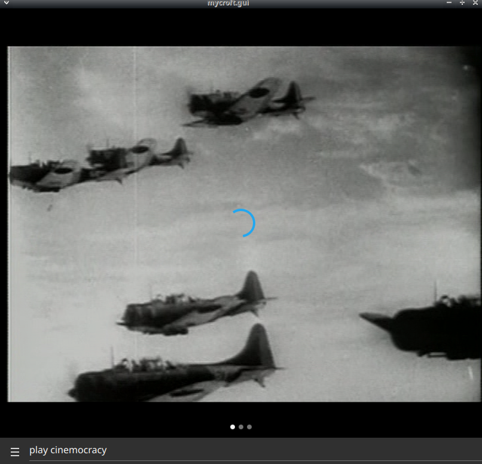

# Cinemocracy Collection

## About

In the early 1940s, the United States government commissioned some of the best filmmakers to create propaganda in support of the war effort. The works of the most famous of those directors, John Ford, John Huston, Frank Capra, and William Wyler, are the subjects of this collection. In contrast to today's environment (where many politicians think of Hollywood as the devil and most contemporary political cinema targets the government as irrational and inequitable) in the 1940s, everyone appeared to be on the same side. The films in this collection are examples of Cinemocracy, the relationship between motion pictures and government. These films are from the personal collection of Eric Spiegelman.

## Installation Notes

this requires [skill-better-playback-control](https://github.com/JarbasSkills/skill-better-playback-control), it will blacklist and replace the official mycroft skill

## Examples

* "open cinemocracy"
* "play real war videos"
* "play old war video"
* "play cinemocracy"

# Platform support

- :heavy_check_mark: - tested and confirmed working
- :x: - incompatible/non-functional
- :question: - untested
- :construction: - partial support

|     platform    |   status   |  tag  | version | last tested | 
|:---------------:|:----------:|:-----:|:-------:|:-----------:|
|    [Chatterbox](https://hellochatterbox.com)   | :question: |  dev  |         |    never    | 
|     [HolmesV](https://github.com/HelloChatterbox/HolmesV)     | :question: |  dev  |         |    never    | 
|    [LocalHive](https://github.com/JarbasHiveMind/LocalHive)    | :question: |  dev  |         |    never    |  
|  [Mycroft Mark1](https://github.com/MycroftAI/enclosure-mark1)    | :question: |  dev  |         |    never    | 
|  [Mycroft Mark2](https://github.com/MycroftAI/hardware-mycroft-mark-II)    | :question: |  dev  |         |    never    |  
|    [NeonGecko](https://neon.ai)      | :question: |  dev  |         |    never    |   
|       [OVOS](https://github.com/OpenVoiceOS)        | :question: |  dev  |         |    never    |    
|     [Picroft](https://github.com/MycroftAI/enclosure-picroft)       | :question: |  dev  |         |    never    |  
| [Plasma Bigscreen](https://plasma-bigscreen.org/)  | :question: |  dev  |         |    never    |  

- `tag` - link to github release / branch / commit
- `version` - link to release/commit of platform repo where this was tested

## Credits
- JarbasAl
- [AIIX](https://github.com/AIIX/) - GUI
- [Cinemocracy](https://archive.org/details/cinemocracy?tab=about)

## Category
**Entertainment**
**Information**

## Tags
#public-domain
#war
#video
#entertainment
